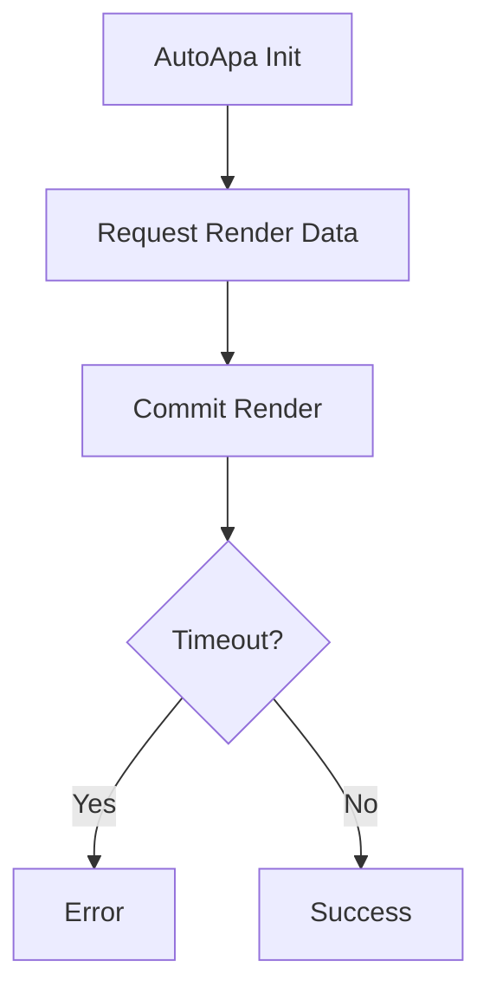

# Logcat Agent

> AI-Powered Android Debug Agent

Turn Android screen recordings into logs, source code insights, and AI-powered root cause analysis.

---

## What Problem Does It Solve?

Android debugging usually looks like this:

```text
Screen Recording
        +
Android Export Log
        +
Source Code

↓
Watch Video
↓
Remember Timestamp
↓
Extract Logs
↓
Search Logcat
↓
Search Source Code
↓
Analyze Root Cause
```

A single bug can take 30 minutes to several hours to investigate.

Logcat Agent automates this workflow.

---

## Vision

```text
Video
 ↓
Timestamp OCR
 ↓
Voice Understanding
 ↓
Logcat Location
 ↓
Source Mapping
 ↓
Flow Analysis
 ↓
ChatGPT
 ↓
Root Cause Report
```

---

## Features

### Video OCR Agent

Extract timestamps directly from screen recordings.

### Python Runtime Packaging

The distributed Python service should be built from the runtime-only dependency set:

```bash
./scripts/build_python_runtime.sh
```

This runtime intentionally excludes training/CUDA packages, which now live in
the separate training workspace at `/home/xjmz/Ai/logcatagent`.

OCR inference uses `onnxruntime` and `timestamp_crnn_best.onnx`; subtitles use the FunASR ONNX runtime.

### Built-in FFmpeg

Put the FFmpeg binaries for each target platform here before building:

```text
third_party/
  ffmpeg/
    windows/
      ffmpeg.exe
      ffprobe.exe
    macos/
      ffmpeg
      ffprobe
    linux/
      ffmpeg
      ffprobe
```

Only `ffmpeg` and `ffprobe` are required for the platform you are packaging. The desktop builds copy them next to the app executable, and the app uses the bundled FFmpeg first instead of depending on the user's system environment or `PATH`.

During development, the local FunASR model can live next to the OCR model:

```text
pythonai/
  timestamp_crnn_best.onnx
  funasr-paraformer-zh/
    config.yaml
    model_quant.onnx
    tokens.json
    ...
```

All runtime models can be installed from one downloadable archive:

```bash
./scripts/install_models.sh https://example.com/logagent-models.zip
```

Expected archive layout:

```text
logagent-models/
  timestamp_crnn_best.onnx
  funasr-paraformer-zh/
    config.yaml
    model.onnx or model_quant.onnx
    tokens.txt or tokens.json
    ...
```

At runtime the same archive can be configured with:

```bash
export LOGCAT_AGENT_MODEL_BUNDLE_URL=https://example.com/logagent-models.zip
```

Supported formats:

```text
05-07 16:46:59
05-07 16:46:59.170
2026-05-07 16:46:59
```

### Bug Voice Agent

Extract bug descriptions from tester recordings.

Example:

```text
Tester:
点击自动泊车以后，界面卡住了，车辆没有进入泊车流程。
```

Automatically converted to:

```json
{
  "bug_description": "点击自动泊车以后界面卡住，车辆没有进入泊车流程"
}
```

### Logcat Agent

Automatically:

```text
Locate Timestamp
 ↓
Search Related Logs
 ↓
Group By Tag
 ↓
Highlight Critical Events
```

### Source Agent

Automatically map:

```text
Tag
 ↓
Class
 ↓
Source File
 ↓
Function
```

Example:

```text
AutoApa_EngineSomeIpNativeManager

↓

EngineSomeIpNativeManager.cpp
Line 456
```

### Flow Agent

Generate Mermaid flowcharts from logs.



### ChatGPT Root Cause Agent

Combine:

```text
Bug Description
+
Timestamp
+
Related Logs
+
Source Code
+
Flowchart
```

Generate:

```text
Problem Summary
Key Timeline
Related Logs
Related Source Files
Possible Root Cause
Suggested Fix
```

---

## Architecture

```text
Flutter Desktop
│
├── Video Player
├── Subtitle Overlay
├── Logcat Viewer
├── Source Viewer
└── AI Debug Tree
│
▼
Rust
│
├── ZIP Extraction
├── tar.lz4 Extraction
└── Audio Extraction
│
▼
Python
│
├── OCR Agent
├── Voice Agent
├── Log Agent
├── Source Agent
├── Flow Agent
└── ChatGPT Agent
│
▼
AI Root Cause Report
```

---

## Workflow

```text
Import Video
 ↓
Import Android Export Log
 ↓
OCR Timestamp
 ↓
Voice Transcription
 ↓
Locate Logcat
 ↓
Generate Flowchart
 ↓
Map Source Code
 ↓
ChatGPT Analysis
 ↓
Root Cause Report
```

---

## Tech Stack

### Frontend

- Flutter
- media_kit
- flutter_rust_bridge

### Backend

- Rust
- Python

### AI

- ONNXRuntime
- FunASR
- ChatGPT

### Search

- ripgrep
- Universal Ctags

---

## Roadmap

### Current

- [x] Video OCR
- [x] Android Log Extraction
- [x] Timestamp Location

### Next

- [ ] Bug Voice Agent
- [ ] Flutter Logcat Viewer
- [ ] Source Agent
- [ ] Flow Agent

### Future

- [ ] ChatGPT Root Cause Agent
- [ ] Android Debug Report Generator
- [ ] Autonomous Android Debug Agent

---

## Why Logcat Agent?

Most tools only analyze logs.

Logcat Agent understands:

```text
Video
+
Voice
+
Logs
+
Source Code
```

and turns them into actionable debugging insights.

---

## Star

If this project helps you, please give it a Star.

https://github.com/qli917/logcat_agent
