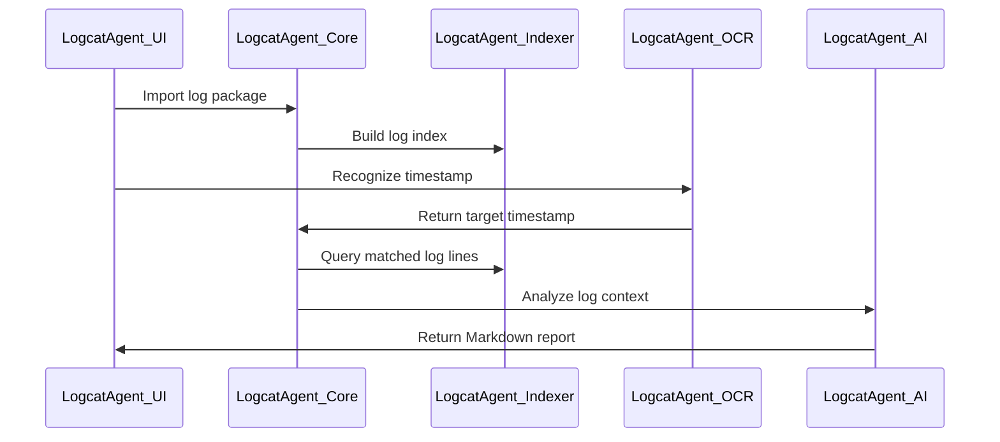

# Logcat Agent

[中文](./README.md) | [English](./README.en.md)

一个面向 Android 日志分析场景的智能 Logcat 辅助工具。

---

## 项目简介

Logcat Agent 主要用于处理大型 Android 日志压缩包、视频时间戳识别、日志时间定位、关键行检索以及 AI 日志分析，目标是把繁琐的人工查日志流程自动化。

在 Android 开发、测试和问题排查过程中，经常会遇到以下问题：

- 日志压缩包很大，解压和检索速度慢
- 日志文件数量多，不知道目标时间点在哪个文件里
- 视频录屏里的时间戳需要人工查看
- 需要根据时间戳快速定位对应 log 行
- 日志内容复杂，人工分析耗时较长

Logcat Agent 通过 Flutter、Rust、Python 和 AI 分析能力组合，构建一个本地化的日志分析助手。

---

## 核心功能

### 1. 大日志压缩包处理

支持对大型 zip 日志包进行快速解压和索引，为后续检索做准备。

目标能力：

- 快速解压大型日志压缩包
- 自动扫描 log / txt 文件
- 建立时间戳索引
- 支持后续秒级检索

### 2. 时间戳检索

根据用户输入或 OCR 识别出的时间戳，快速定位到对应日志文件和目标行。

支持的时间格式示例：

```text
05-07 16:46:59.170
2026-05-07 16:46:59
16:46:59
```

### 3. OCR 时间识别

通过 Python OCR 服务识别截图或视频画面中的时间戳，用于自动匹配日志时间点。

当前方向：

- 视频帧截图
- 时间戳区域裁剪
- OCR 识别
- 时间格式修正
- 与日志时间自动匹配

### 4. AI 日志分析

调用 ChatGPT API，对定位到的日志片段进行分析，辅助判断问题原因。

可用于：

- 异常日志总结
- crash / ANR / error 分析
- 关键调用链提取
- 可疑日志解释
- 问题排查建议生成

### 5. Flutter 可视化界面

使用 Flutter 构建桌面端或跨平台操作界面，降低日志分析使用门槛。

计划支持：

- 导入 zip 日志包
- 上传截图或视频
- OCR 识别时间戳
- 输入目标时间点
- 展示匹配到的日志文件
- 高亮选中目标日志行
- 一键提交 AI 分析

### 6. Tag Markdown 报告与日志流程图

支持用户输入指定 Tag 或 Tag 前缀，例如 `LogcatAgent`，自动提取匹配日志，生成结构化 Markdown 分析报告。

目标能力：

- 根据 Tag / Tag 前缀筛选日志
- 汇总相关 Tag 的日志数量和时间范围
- 生成关键时间线
- 生成 Mermaid 日志流程图
- 标记 warning / error / crash 等可疑日志
- 通过内部链接跳转到原始日志具体位置

---

## 技术架构

```text
Flutter UI
   ↓
Rust 日志处理核心
   ↓
Python OCR 服务
   ↓
ChatGPT API 日志分析
```

整体流程由 Flutter 负责界面交互，Rust 负责高性能日志解压和检索，Python 负责 OCR 时间戳识别，ChatGPT API 负责日志分析和问题总结。

---

## 技术栈

| 模块 | 技术 | 作用 |
|---|---|---|
| 前端界面 | Flutter | 构建跨平台可视化界面 |
| 日志处理 | Rust | 高性能解压、检索、索引 |
| OCR 服务 | Python / FastAPI / OCR 模型 | 识别截图或视频中的时间戳 |
| 数据存储 | SQLite | 保存日志索引、文件路径、时间映射 |
| AI 分析 | ChatGPT API | 对日志片段进行智能分析 |
| 平台环境 | Linux / Ubuntu | 当前主要开发和运行环境 |

---

## 推荐项目结构

```text
logcat_agent/
├── flutter_app/              # Flutter 客户端
│   ├── lib/
│   ├── pubspec.yaml
│   └── ...
│
├── rust_core/                # Rust 日志处理模块
│   ├── src/
│   ├── Cargo.toml
│   └── ...
│
├── pythonai/                 # Python OCR / AI 服务
│   ├── app.py
│   ├── requirements.txt
│   ├── timestamp_crnn.pt
│   ├── timestamp_crnn_best.pt
│   └── ...
│
├── data/                     # 本地数据目录
│   ├── logs/
│   ├── cache/
│   └── index.db
│
├── README.md                 # 中文文档
├── README.en.md              # English documentation
└── .gitignore
```

---

## 使用场景

### Android 问题排查

适用于 Android 测试、系统开发、APP 开发中的日志排查场景。

例如：

- 根据录屏时间找到对应 logcat
- 从大量日志中定位错误发生点
- 快速分析 crash 前后的日志
- 对系统日志、应用日志进行 AI 总结

### 测试日志分析

测试人员可以通过录屏时间点和日志包，快速定位问题发生时刻对应的日志内容。

### AOSP / Framework 开发排查

适合 Android 系统开发中对 logcat、kernel log、系统服务日志进行辅助分析。

### 指定模块日志链路分析

适合对某个业务模块或系统模块做定向分析，例如用户输入 `LogcatAgent`，系统只关注相关 Tag 的日志，生成模块级日志报告和流程图。

---

## 基本流程

```text
1. 导入日志 zip 包
2. Rust 解压并建立索引
3. 导入录屏或截图
4. Python OCR 识别时间戳
5. 根据时间戳检索日志文件
6. Flutter 展示命中的日志行
7. 调用 ChatGPT API 分析日志上下文
8. 输出问题原因和排查建议
```

---

## Tag Markdown 报告设计

Tag Markdown 报告是 Logcat Agent 的重点功能之一。用户可以输入一个完整 Tag 或 Tag 前缀，例如：

```text
LogcatAgent
```

系统会自动匹配相关日志，例如：

```text
LogcatAgent_Core
LogcatAgent_Indexer
LogcatAgent_OCR
LogcatAgent_AI
LogcatAgent_UI
```

然后生成一个 Markdown 报告，用于快速理解该模块在日志中的执行过程。

### 处理流程

```text
用户输入 Tag / Tag 前缀
   ↓
Rust 从日志索引中筛选匹配日志
   ↓
SQLite 返回日志 ID、时间、Tag、文件路径、行号、byte offset
   ↓
AI 分析关键阶段、异常点和状态变化
   ↓
生成 Markdown 报告
   ↓
Flutter 展示报告和流程图
   ↓
点击链接跳转到原始日志具体行
```

### Markdown 报告示例

````md
# LogcatAgent 日志分析报告

## 基本信息

- Tag 前缀：LogcatAgent
- 匹配日志数量：1286 行
- 时间范围：16:46:59.170 ~ 16:48:22.530
- 涉及线程数：8
- 涉及进程数：2

## Tag 汇总

| Tag | 数量 | 说明 |
|---|---:|---|
| LogcatAgent_Core | 328 | 主流程调度 |
| LogcatAgent_Indexer | 246 | 日志索引构建 |
| LogcatAgent_OCR | 185 | 时间戳识别 |
| LogcatAgent_AI | 142 | AI 日志分析 |
| LogcatAgent_UI | 96 | 界面交互 |

## 关键时间线

- 16:46:59.170 开始导入日志包 [查看原始日志](logcat://entry/1024)
- 16:47:01.230 解压完成并开始扫描日志文件 [查看原始日志](logcat://entry/1088)
- 16:47:05.610 时间戳索引构建完成 [查看原始日志](logcat://entry/1210)
- 16:47:08.320 OCR 识别到目标时间点 [查看原始日志](logcat://entry/1342)
- 16:47:11.900 生成 AI 分析报告 [查看原始日志](logcat://entry/1511)

## 流程图



## 可疑日志

### Warning

- 16:47:06.120 LogcatAgent_Indexer: timestamp parse failed [查看](logcat://entry/1233)
- 16:47:09.880 LogcatAgent_OCR: low confidence timestamp result [查看](logcat://entry/1402)

### Error

- 16:47:12.230 LogcatAgent_AI: request timeout [查看](logcat://entry/1566)
````

### 跳转设计

Markdown 中不直接暴露本地文件路径，而是使用内部协议链接：

```md
[查看原始日志](logcat://entry/1024)
```

Flutter 拦截 `logcat://entry/1024` 后，从 SQLite 查询对应的日志位置：

```text
entry_id → file_path → line_number → byte_offset
```

然后在原始日志查看器中跳转到对应文件和行号，并高亮目标日志。

### 建议的索引字段

```sql
CREATE TABLE log_entries (
    id INTEGER PRIMARY KEY AUTOINCREMENT,
    timestamp TEXT,
    level TEXT,
    pid TEXT,
    tid TEXT,
    tag TEXT,
    message TEXT,
    file_path TEXT,
    line_number INTEGER,
    byte_offset INTEGER
);
```

查询指定 Tag 前缀：

```sql
SELECT *
FROM log_entries
WHERE tag LIKE 'LogcatAgent%'
ORDER BY timestamp ASC;
```

这个设计可以让 Logcat Agent 不只是查看日志，而是形成：

```text
Tag 过滤 → 日志聚合 → 时间线 → 流程图 → AI 分析 → 原始日志跳转
```

---

## 本地运行

### 1. 克隆项目

```bash
git clone git@github.com:qli917/logcat_agent.git
cd logcat_agent
```

### 2. 启动 Python OCR 服务

```bash
cd pythonai
pip install -r requirements.txt
python app.py
```

如果使用 FastAPI：

```bash
uvicorn app:app --host 0.0.0.0 --port 8000
```

### 3. 启动 Flutter 客户端

```bash
cd flutter_app
flutter pub get
flutter run
```

### 4. 构建 Rust 日志处理模块

```bash
cd rust_core
cargo build --release
```

---

## 当前开发状态

项目仍在开发中，当前重点方向如下：

- [ ] 完善 Flutter 日志导入界面
- [ ] 优化 Rust 大文件解压速度
- [ ] 建立 SQLite 日志时间索引
- [ ] 优化 OCR 时间戳识别准确率
- [ ] 支持按时间快速定位日志行
- [ ] 支持指定 Tag / Tag 前缀生成 Markdown 报告
- [ ] 支持 Markdown 内部链接跳转原始日志
- [ ] 支持 Mermaid 日志流程图生成
- [ ] 集成 ChatGPT API 日志分析
- [ ] 增加错误样本收集和模型迭代能力

---

## 后续计划

- 支持更多日志时间格式
- 支持多日志文件联合检索
- 支持日志上下文自动截取
- 支持错误类型自动分类
- 支持 crash / ANR 专项分析
- 支持 Tag 级日志报告导出
- 支持 Markdown / HTML 报告导出
- 支持模型本地化部署
- 支持 Windows / Linux / macOS 桌面端

---

## 项目目标

Logcat Agent 的目标不是简单做一个日志查看器，而是做一个面向 Android 开发和测试场景的智能日志分析 Agent。

它希望完成从：

```text
录屏时间点 → OCR 时间识别 → 日志定位 → 上下文提取 → AI 分析
```

以及：

```text
指定 Tag → 日志聚合 → 时间线 → 流程图 → Markdown 报告 → 原始日志跳转
```

这一整套自动化流程。

---

## 安全说明

请不要将敏感配置、真实用户日志、私人测试数据、环境配置文件或包含隐私信息的数据库文件提交到仓库。

---

## License

当前暂未指定 License。
